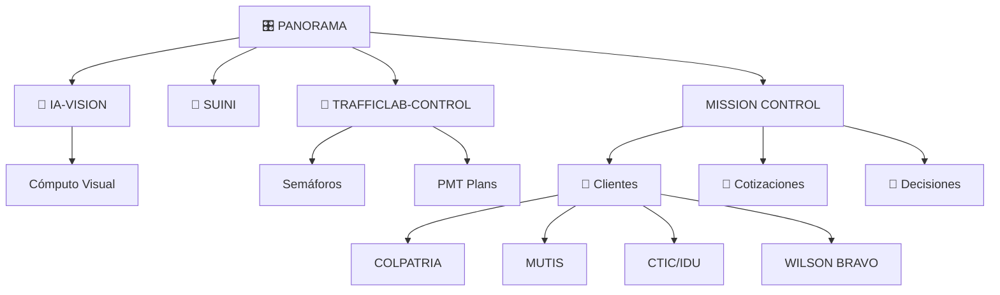

# 🧠 Grafo de Conocimiento

## Cómo funciona

El grafo de Obsidian genera relaciones **automáticamente** a partir de:

1. **`[[wikilinks]]`** — enlaces entre notas (proyectos → clientes → decisiones)
2. **Propiedades YAML** (`client:`, `proyectos:`, `tags:`) — enriquecen los nodos
3. **Backlinks** — páginas que referencian una nota

**El Mermaid ya no es la fuente de verdad.** Es solo un dibujo explicativo.

---

## Generar el grafo en Obsidian

1. Abrir **Graph View** en Obsidian (`Ctrl+Shift+G`)
2. Filtros: filtrar por carpeta, tags o enlaces
3. El grafo muestra nodos = notas, aristas = wikilinks

---

## Relaciones actuales detectadas

*(consultar base)*

---

## Proyectos → Clientes (wikilinks reales)

*(consultar base)*

---

## Estructura conceptual (explicativa, no fuente de verdad)

> **Eliminar este Mermaid cuando los wikilinks reales sean suficientes.**

---

## Reglas para mantener el grafo limpio

- Cada nota de proyecto debe enlazar a sus **clientes** con `[[wikilink]]`
- Cada nota de cliente debe enlazar a sus **proyectos** con `[[wikilink]]`
- Propiedades en frontmatter: `client:`, `proyectos:`, `years:`
- **No hardcodear relaciones en Mermaid** — solo en wikilinks reales
